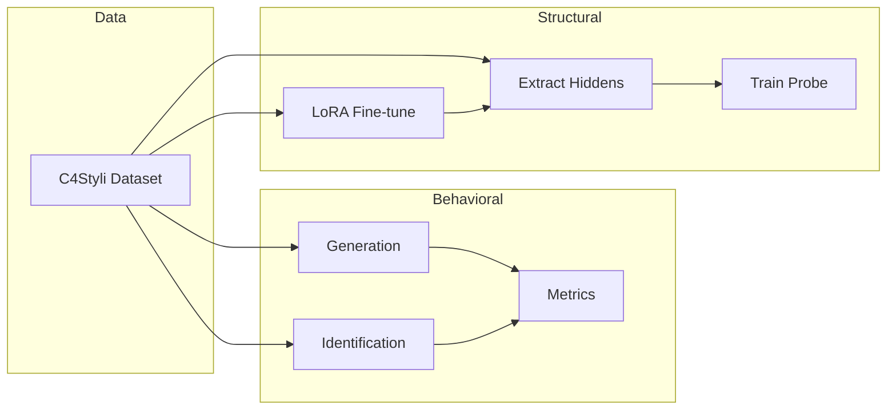

# Probing Cultural Awareness in LLMs: A Case Study of Cross-Culture Aesthetic Stylistics

This repository provides code and data for the research project **"Probing Cultural Awareness in LLMs: A Case Study of Cross-Culture Aesthetic Stylistics"**. It supports a systematic evaluation of how large language models perceive **cross-cultural Chinese aesthetic stylistics**, Mainland Mandarin vs. Hong Kong Cantonese (traditional Chinese).

Using the **C4Styli** (Cross-Culture Chinese-Chinese Stylistics) dataset, we compare model performance across three lines of analysis:

| Task | Description |
|------|-------------|
| **Generation** | Given English metadata, generate Chinese movie titles or advertising slogans in Mainland or Hong Kong style |
| **Identification** | Classify whether a given Chinese text follows Mainland (CN) or Hong Kong (HK) stylistic conventions |
| **Structural Ablation** | Extract layer-wise hidden states and train probes to test whether CN/HK regional information is decodable internally |

The repo also includes **style analysis** and **visualization** tools for interpretability.

---

## Repository Structure

```
culture-awareness/
├── C4Styli/                  # Dataset layout + collection scripts
│   ├── titles/               # Movie-title splits (JSON)
│   ├── slogans/              # Ad-slogan splits + Bilibili/YouTube/Wiki crawlers
│   └── lexicon/              # Region-specific affect lexicons
├── prompts/                  # Prompt templates (task × region × shot setting)
├── generation/               # Generation: API inference + metrics
├── identification/           # Identification: API inference + metrics
├── structural_ablation/      # Hidden-state extraction, LoRA, probes (code only in Git)
├── style_analysis/           # Activation tracking and ablation
├── visualization/            # Word clouds, clustering, plots
├── configs/                  # DeepSpeed and training configs
├── requirements.txt
└── utils.py                  # Local only — not tracked (see below)
```

### What Git tracks vs. local files

Several paths are listed in [`.gitignore`](.gitignore) and are **not** pushed to the remote. Prepare them on your machine before running experiments:

| Path / pattern | Purpose |
|----------------|---------|
| `utils.py` | Shared data loading, prompts, and text normalization (required by most scripts) |
| `api_key.json` | Optional local API config; prefer environment variables instead |
| `C4Styli/*.json`, `*.txt`, `*.ttf`, `*.pdf` | Root-level dataset assets and fonts (subfolders `titles/`, `slogans/`, `lexicon/` are used at runtime) |
| `structural_ablation/*.json` | Probe / finetune / validation manifests (build with `process_data.py`) |
| `structural_ablation/*.npy`, `*.joblib`, `*.pdf` | Cached activations, probes, and figures |
| `generation/output/`, `identification/output/` | Model outputs |
| `generation/*.log`, `identification/*.log`, `logs/` | Run logs |
| `*.sh` | Local launch scripts (examples below use inline commands) |
| `model_training/` | Legacy directory name (ignored if present) |

Obtain `utils.py` and C4Styli data from the authors or regenerate them with the provided scripts; do not commit secrets or large artifacts.

---

## C4Styli Dataset

C4Styli covers two stylistic domains:

### 1. Movie Titles

- **Source:** English metadata from TMDB, paired with human-aligned Mainland/Hong Kong Chinese titles
- **Fields:** `TITLE`, `TITLE (CN)`, `TITLE (HK)`, `PLOT SUMMARY`, `YEAR`, etc.
- **Splits:** `train_*`, `val_*`, `probe_*`, `finetune_*`

### 2. Advertising Slogans

- **Source:** Classic ad copy from Bilibili, YouTube, Wikipedia, and related platforms
- **Fields:** `company`, `product`, `slogan`, `date`, `region` (`CN` / `HK`)
- **Crawlers:** `C4Styli/slogans/bilibili_extract.py`, `youtube_extract.py`, `wiki_extract.py`

### Auxiliary Resources

Root-level files such as `human_baseline (golden).json`, `reformulation_affective_movie_titles.json`, and `modifier_ration_*.json` live under `C4Styli/` but are **gitignored** at the repository root; keep local copies when running analysis. Lexicons under `C4Styli/lexicon/` can be built with `extract_lexicon.py`.

---

## Setup

### Dependencies

Install all dependencies from the project root:

```bash
pip install -r requirements.txt
```

## Usage

### 1. Behavioral Experiments: Generation / Identification

Both scripts call models via an OpenAI-compatible API in batch, with multiprocessing and resume support (skips already-processed `input_text` entries).

**Generation** — produce region-appropriate Chinese text from English plot/ad metadata:

```bash
python generation/generation.py \
    --dataset_path C4Styli/titles/val_movie_titles.json \
    --text_domain titles \
    --url_base https://api.deepseek.com \
    --model deepseek-chat \
    --prompt_region CN \
    --zero \
    --output_file generation/output/deepseek_titles_cn_zero.json \
    --batch_size 16
```

**Identification** — classify text as CN or HK:

```bash
python identification/classification.py \
    --dataset_path C4Styli/slogans/val_advertise_slogans.json \
    --text_domain slogans \
    --url_base https://api.deepseek.com \
    --model deepseek-chat \
    --prompt_region HK \
    --zero \
    --output_file identification/output/deepseek_slogans_hk_zero.json \
    --batch_size 16
```

#### Key Arguments

| Argument | Description |
|----------|-------------|
| `--text_domain` | `titles` or `slogans` |
| `--prompt_region` | `CN` (simplified/Mainland prompts) or `HK` (traditional/Hong Kong prompts) |
| `--zero` | Use zero-shot prompts; omit for few-shot (`sample`) |
| `--url_base` | API base URL (e.g. `https://api.deepseek.com`, `http://127.0.0.1:8000/v1`) |

Prompt templates live in `prompts/` with the naming pattern `{domain}_{task}_{region}_{shot}.txt`, e.g. `title_generation_cn_zero.txt`.

Shell launchers (`*.sh`) are gitignored; wrap the commands above in your own local scripts if needed.

### 2. Evaluation Metrics

**Identification** — accuracy, macro F1, etc.:

```bash
python identification/metric.py \
    --input_file identification/output/your_output.json
```

**Generation** — semantic preservation, regional distinction (sentence-embedding similarity):

```bash
python generation/metric.py --model_name YourModel
```

### 3. Structural Probing

Under `structural_ablation/`, probe whether cultural region (CN/HK) is linearly decodable from hidden states. JSON / `.npy` / `.joblib` / `.pdf` files in this folder are gitignored—generate them locally:

```
1. process_data.py      → Write probe / finetune / validation JSON (local, untracked)
2. fine_tune.py         → LoRA fine-tuning (optional; or ms-swift CLI)
3. extract_hiddens.py   → Extract hidden states to .pt / .npy (local cache)
4. train_probe.py       → Train probes; metrics and plots stay local
```

**Build manifests (if missing):**

```bash
python structural_ablation/process_data.py
```

**Extract hidden states:**

```bash
python structural_ablation/extract_hiddens.py \
    --model_name_or_path /path/to/Qwen2.5-7B-Instruct \
    --file_path structural_ablation/probe_dataset_general.json \
    --output_dir structural_ablation/features/Qwen2.5-7B-Instruct \
    --batch_size 12 \
    --model_arch Qwen2
```

**Train a probe:**

```bash
python structural_ablation/train_probe.py \
    --probe_type nonlinear_nn \
    --train_data_path structural_ablation/features/Qwen2.5-7B-Instruct/probe_train_features.pt \
    --layer_index attn_21 \
    --eval_metrics AUROC Spearman \
    --num_epochs 10
```

### 4. Style Analysis & Visualization

| Module | Function |
|--------|----------|
| `style_analysis/track.py` | Track activation patterns at specific layers (Transformer Lens) |
| `style_analysis/ablation.py` | Clustering, logistic regression, and other ablations on representations |
| `visualization/data_visual.py` | Word clouds and regional distribution statistics |
| `visualization/cluster.py` | DBSCAN clustering and visualization on hidden states |

```bash
python visualization/cluster.py \
    --model /path/to/model \
    --layers top_2_3 \
    --data-type slogans \
    --output-prefix cluster_output
```

### 5. Dataset Construction (Optional)

```bash
# Crawl ad copy from Bilibili / YouTube / Wikipedia
python C4Styli/slogans/bilibili_extract.py
python C4Styli/slogans/youtube_extract.py
python C4Styli/slogans/wiki_extract.py

# Extract affect lexicons
python C4Styli/extract_lexicon.py --dataset_path C4Styli/slogans/train_advertise_slogans.json
```

---

## Experimental Overview



- **Behavioral layer:** Can models generate and recognize region-appropriate Chinese stylistics?
- **Structural layer:** Is regional information encoded in specific attention layers?
- **Analysis layer:** Lexicons, clustering, and activation tracing for interpretability

---

## Notes

1. **`.gitignore`:** See [What Git tracks vs. local files](#what-git-tracks-vs-local-files) for the full list; in short: no `utils.py`, no root `C4Styli/*.{json,txt,ttf,pdf}`, no `structural_ablation` artifacts, no `*.sh`, no experiment outputs or logs.
2. **`utils.py`:** Required at the project root for `generation/`, `identification/`, `visualization/`, and related entry points; keep your copy local.
3. **Model paths:** Replace lab paths such as `/data/models/...` with your Hugging Face cache or checkpoint directories.
4. **Legacy `model_training/`:** Ignored if present; use `structural_ablation/` for probing code and data.

---

## Citation

If you use this repository in your research, please cite the associated paper (BibTeX to be added upon publication).

---

## License

See the repository license file if present. The dataset is intended for academic research only; crawled third-party data must comply with each platform's terms of service.
